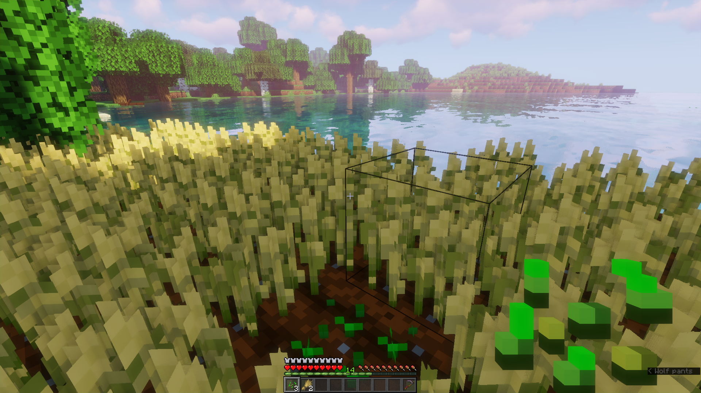

# Quick Harvest [1.13+] 
Plugin that let players on the server harvest the plants by pressing  and automatic replant it again at the same moment!
- [Features](#features)
- [Default settings in `config.yml`](#default-settings-in-configyml)




### Features
- Quick harvest by dispenser! (You can disable this feature in plugin config)
- To quick harvest press ! (You can disable this feature in plugin config)
- Expand the list of supported plants at your discretion! Currently supported:
  - `minecraft:wheat`
  - `minecraft:beetroots`
  - `minecraft:potatoes`
  - `minecraft:carrots`
  - `minecraft:nether_wart`
  - `minecraft:cocoa`

### Default settings in `config.yml`
```yml
sound: minecraft:block.composter.ready  # played sound when quick harvest

feature:
  player: default                       # quick harvest by right-click:
                                        #   default - harvested items will automatically save to inventory
                                        #   vanilla - harvested items will just drop on the ground
                                        #   disabled - completely disable this feature

  dispenser: yes                        # quick harvest by dispenser (yes/no)

reason:
  minecraft:wheat_seeds:                # item in hand
    target: minecraft:wheat             # harvest block (works when harvest age equals max age)

  minecraft:beetroot_seeds:
    target: minecraft:beetroots

  minecraft:potato:
    target: minecraft:potatoes

  minecraft:carrot:
    target: minecraft:carrots

  minecraft:nether_wart:
    target: minecraft:nether_wart

  minecraft:cocoa_beans:
    target: minecraft:cocoa

```
